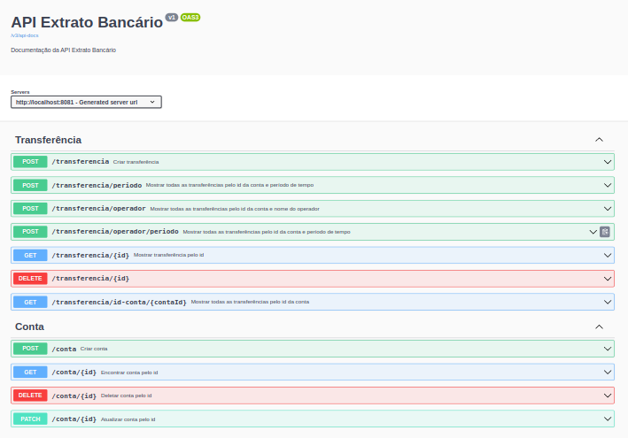

# Boas vindas ao repositório do projeto Extrato Bancário

[](https://github.com/Humberto-Bonadiman/Extrato_Bancario/actions/workflows/docker-publish.yml)

---

## Descrição do projeto

Neste projeto eu fui responsável por construir uma camada de serviço, para uma operação muito realizada em bancos, para emissão de extrato bancário.

---

## Instalação do projeto localmente

Após cada um dos passos, haverá um exemplo do comando a ser digitado para fazer o que está sendo pedido.

1. Realize o clone do projeto no diretório de sua preferência:
```javascript
git clone git@github.com:humberto-bonadiman/Extrato_Bancario.git
```

2. Acesse o diretório do projeto e depois utilize o comando **mvn install** para instalar todas as dependências necessárias:
```javascript
  cd Extrato_Bancario
  mvn install
```

3. Após empacote o código compilado com o comando **mvn package**:
```javascript
mvn package
```

## Comandos para utilizar o Docker

Para criar e iniciar os contêineres:
</br>
Obs.: Com o comando abaixo o docker fica rodando no terminal.
```javascript
docker-compose up
```

Para criar e iniciar os contêineres em stand-by:
```javascript
docker-compose up -d
```

Para realizar apenas a etapa de build das imagens que serão utilizadas:
```javascript
docker-compose build
```

Para paralisar e remover todos os contêineres e seus componentes como rede, imagem e volume:
```javascript
docker-compose down
```
---

## Utilizando o Spring-boot sem o Docker

No arquivo que está no caminho **/src/main/resources/application.yml** você deve alterar a 9ª(username) e a 10ª(password) linha com o usuário e senha do seu MySQL:
```javascript
spring:
  datasource:
    username: username
    password: password
```

Rodar o Spring-Boot com o comando:
```javascript
mvn spring-boot:run
```

---

## Realização dos testes

Para realizar todos os testes da aplicação você pode utilizar o seguinte comando:
```javascript
mvn clean test
```

Para realizar somente um teste específico você deve utilizar o comando:
```javascript
mvn test -Dtest=O_nome_do_teste_vai_aqui
```

Exemplo:
```javascript
mvn test -Dtest=CriarContaTest
```

Para realizar mais de um teste basta adicionar uma vírgula ao final do teste conforme o exemplo:
```javascript
mvn test -Dtest=CriarContaTest,DeletarContaTest
```

Para realizar os testes do pacote **conta** você deve utilizar o seguinte comando:
```javascript
mvn test -Dtest="br.com.banco.conta.**"
```

Para realizar os testes do pacote **transferencia** você deve utilizar o seguinte comando:
```javascript
mvn test -Dtest="br.com.banco.transferencia.**"
```

## Documentação



Para acessar a documentação pelo swagger rode o comando **mvn spring-boot:run** ou **docker-compose up** e acesse o projeto via browser, no caminho http://localhost:8081/swagger-ui/index.html ou pelo caminho http://localhost:8081/v3/api-docs.
